+++
date = '2026-02-13T18:16:01-08:00'
draft = false
title = 'Practica1: Elementos basicos de los lenguajes de programacion'
+++

# Introducción

En esta práctica se desarrolló un simulador de cola de impresión utilizando el lenguaje C.  
El objetivo fue comprender cómo funciona la estructura de datos llamada **cola** y cómo se puede aplicar en un problema real como el manejo de trabajos de impresión.

En muchos sistemas, como las impresoras, los documentos enviados por los usuarios se colocan en una lista de espera.  
El documento que llega primero es el primero en procesarse. Este comportamiento se conoce como **FIFO (First In First Out)**.

Durante la práctica se implementaron diferentes versiones de la cola.  
Primero se realizó con memoria estática utilizando arreglos y posteriormente se migró a memoria dinámica utilizando listas enlazadas.

Esto permitió comprender mejor conceptos importantes del lenguaje C como:

- manejo de memoria
- uso de estructuras
- enumeraciones
- diseño de funciones
- organización de datos

---

# Objetivo

El objetivo de esta práctica fue implementar una cola de impresión para comprender cómo funcionan las estructuras de datos tipo cola y cómo pueden utilizarse para administrar procesos en orden.

También se buscó aprender el manejo de memoria estática y dinámica, así como organizar un programa mediante funciones, estructuras y tipos de datos definidos por el usuario.

---

# Sesión 1: Cola con memoria estática

## 3.1 Meta

El objetivo de esta primera sesión fue implementar una cola funcional utilizando memoria estática mediante un arreglo de tamaño fijo. En esta versión no se permite el uso de memoria dinámica, por lo que no se deben utilizar funciones como `malloc`, `calloc`, `realloc` o `free`.

La estructura de datos debía permitir almacenar trabajos de impresión dentro de un arreglo y administrar su orden de procesamiento siguiendo el principio **FIFO (First In First Out)**. Esto significa que el primer trabajo que entra a la cola será el primero en ser procesado.

Para lograrlo se utilizó una estructura que contiene un arreglo donde se almacenan los trabajos de impresión y una variable que indica cuántos elementos hay actualmente en la cola.

---

## 3.2 Reglas y criterios de aceptación

Para que la implementación de la cola estática fuera válida, se establecieron algunas reglas que debían cumplirse durante el desarrollo del programa.

- Está **prohibido utilizar memoria dinámica**, por lo tanto no se deben usar funciones como `malloc`, `calloc`, `realloc` o `free`.
- La cola debe tener una **capacidad fija de diez trabajos** (`MAX_JOBS = 10`).
- Si la cola está llena, **no se debe permitir agregar nuevos trabajos**.
- Si la cola está vacía, **no se debe permitir ejecutar operaciones como `peek` o `dequeue`**.
- El programa debe **compilar sin errores ni advertencias** utilizando las banderas indicadas por el profesor.

---

## 3.3 Diseño de la solución

Para representar la cola se utilizó una estructura que contiene un arreglo donde se almacenan los trabajos de impresión y una variable que indica cuántos elementos hay actualmente.

La cola funciona de la siguiente manera:

- Los elementos válidos se almacenan desde la posición `0` hasta `size - 1`.
- El **frente de la cola** siempre se encuentra en la posición `data[0]`.
- Cuando se agrega un nuevo trabajo (`enqueue`), este se coloca al final del arreglo.
- Cuando se procesa un trabajo (`dequeue`), se elimina el primer elemento y el resto de los elementos se desplazan hacia la izquierda.

Esto permite mantener el orden correcto de los trabajos dentro de la cola.

### Definición de la estructura de la cola

```c
#define MAX_JOBS 10

typedef struct {
    PrintJob_t data[MAX_JOBS];
    int size;   // cantidad actual de elementos
} QueueStatic_t;
```
## Funciones de la cola estática

Para poder administrar correctamente la cola se implementaron varias funciones.

### Inicialización de la cola

La función qs_init se utiliza para inicializar la cola. Su objetivo es establecer que inicialmente no existen elementos en la cola.

```c

void qs_init(QueueStatic_t* q){
    q->size = 0;
}
```

### Verificar si la cola está vacía

La función qs_is_empty permite verificar si no existen trabajos en la cola.

```c
int qs_is_empty(const QueueStatic_t* q){
    return q->size == 0;
}
```

Si el tamaño de la cola es igual a cero, significa que no hay elementos.

### Verificar si la cola está llena

La función qs_is_full permite verificar si la cola alcanzó su capacidad máxima.

```c
int qs_is_full(const QueueStatic_t* q){
    return q->size == MAX_JOBS;
}
```

Si el número de elementos es igual a MAX_JOBS, no se pueden agregar más trabajos.

## Agregar un trabajo a la cola (enqueue)

La función qs_enqueue agrega un nuevo trabajo al final de la cola.

```c
int qs_enqueue(QueueStatic_t* q, PrintJob_t job){

    if(q->size == MAX_JOBS)
        return 0;

    q->data[q->size] = job;
    q->size++;

    return 1;
}
```

Primero se verifica si la cola está llena.
Si todavía hay espacio disponible, el trabajo se agrega en la posición size y posteriormente se incrementa el tamaño de la cola.

### Consultar el primer elemento (peek)

La función qs_peek permite consultar el primer trabajo de la cola sin eliminarlo.

```c
int qs_peek(const QueueStatic_t* q, PrintJob_t* out){

    if(q->size == 0)
        return 0;

    *out = q->data[0];

    return 1;
}
```

Si la cola está vacía no se puede realizar la operación.

### Procesar un trabajo (dequeue)

La función qs_dequeue elimina el primer elemento de la cola y desplaza los demás elementos hacia la izquierda.

```c
int qs_dequeue(QueueStatic_t* q, PrintJob_t* out){

    if(q->size == 0)
        return 0;

    *out = q->data[0];

    for(int i = 1; i < q->size; i++){
        q->data[i - 1] = q->data[i];
    }

    q->size--;

    return 1;
}
```

El primer elemento se guarda en out y posteriormente todos los elementos restantes se desplazan una posición hacia la izquierda.

## Invariantes de la cola

Durante la implementación se deben cumplir ciertas condiciones que garantizan el correcto funcionamiento de la estructura de datos.

Las invariantes de la cola son las siguientes:

* 0 ≤ size ≤ MAX_JOBS
* Si size == 0, la cola está vacía
* Si size == MAX_JOBS, la cola está llena.
* El frente de la cola siempre se encuentra en data[0] cuando size > 0

Estas condiciones permiten asegurar que la estructura de datos mantenga un comportamiento correcto durante todas las operaciones.

## Análisis de complejidad

En esta implementación, la operación enqueue tiene una complejidad O(1) porque simplemente agrega un elemento al final del arreglo.

Por otro lado, la operación dequeue tiene una complejidad O(n) debido a que se requiere desplazar todos los elementos restantes hacia la izquierda después de eliminar el primero.

Este desplazamiento genera un costo adicional cuando la cola contiene muchos elementos.

Una alternativa para evitar este problema sería utilizar una cola circular o una lista enlazada, las cuales permiten eliminar el primer elemento sin necesidad de mover todos los demás.

# Sesión 2: Migración a memoria dinámica

## Meta

El objetivo de esta segunda sesión fue reemplazar la implementación de la cola basada en un arreglo fijo por una estructura dinámica utilizando una lista enlazada. Esto permite que la cola pueda crecer según sea necesario, eliminando la limitación del tamaño fijo utilizada en la versión estática.

La nueva implementación debía mantener el mismo comportamiento del menú utilizado anteriormente, respetando el principio FIFO (First In First Out). Esto significa que el primer trabajo que entra en la cola debe ser el primero en ser procesado.

El uso de memoria dinámica permite almacenar trabajos de impresión en nodos que se crean durante la ejecución del programa utilizando la función `malloc`. Cada nodo representa un trabajo dentro de la cola.


## Reglas y criterios de aceptación

Para que la implementación de la cola dinámica sea válida se deben cumplir las siguientes condiciones:

- La cola principal debe estar implementada mediante una **lista enlazada dinámica**.
- La función `qd_enqueue` debe verificar que la memoria reservada con `malloc` **no sea NULL** antes de usarla.
- Al terminar la ejecución del programa se debe llamar a la función `qd_destroy` para liberar toda la memoria reservada.
- El comportamiento de la cola debe continuar siendo **FIFO**.
- El programa debe conservar el mismo menú utilizado en la sesión anterior.

Estas reglas garantizan que el programa utilice correctamente memoria dinámica y evite errores como fugas de memoria.


## Diseño sugerido

Para implementar la cola dinámica se utilizó una lista enlazada compuesta por nodos. Cada nodo almacena un trabajo de impresión y un puntero al siguiente nodo de la lista.

### Definición del nodo

```c
typedef struct Node_t {
    PrintJob_t job;
    struct Node_t* next;
} Node_t;
```

En esta estructura:

* job almacena la información del trabajo de impresión.
* next es un puntero al siguiente nodo de la lista.

### Definición de la cola dinámica

```c
typedef struct {
    Node_t* head;  // frente de la cola
    Node_t* tail;  // final de la cola
    int size;
} QueueDynamic_t;
```

En esta estructura:

* head apunta al primer elemento de la cola.
* tail apunta al último elemento de la cola.
* size indica la cantidad de trabajos almacenados.

El uso de head y tail permite que la operación de inserción al final de la cola sea eficiente.

### Operaciones de la cola dinámica

Para administrar la cola dinámica se implementaron varias funciones.

### Inicialización de la cola

La función qd_init se utiliza para inicializar la cola dinámica.

```c
void qd_init(QueueDynamic_t* q){
    q->head = NULL;
    q->tail = NULL;
    q->size = 0;
}
```

Esto indica que inicialmente la cola no contiene elementos.

### Verificar si la cola está vacía

```c
int qd_is_empty(const QueueDynamic_t* q){
    return q->head == NULL;
}
```

Si head es NULL, significa que la cola está vacía.

### Agregar un trabajo a la cola (enqueue)

La función qd_enqueue crea un nuevo nodo utilizando malloc y lo agrega al final de la cola.

```c
int qd_enqueue(QueueDynamic_t* q, PrintJob_t job){

    Node_t* newNode = (Node_t*)malloc(sizeof(Node_t));

    if(newNode == NULL)
        return 0;

    newNode->job = job;
    newNode->next = NULL;

    if(q->tail == NULL){
        q->head = newNode;
        q->tail = newNode;
    }
    else{
        q->tail->next = newNode;
        q->tail = newNode;
    }

    q->size++;

    return 1;
}
```

Primero se reserva memoria para el nuevo nodo.
Si malloc devuelve NULL, significa que no se pudo reservar memoria.

Si la cola está vacía, el nuevo nodo se convierte en el primer elemento.
En caso contrario, se agrega al final de la lista.

### Consultar el primer elemento (peek)

La función qd_peek permite consultar el primer trabajo sin eliminarlo.

```c
int qd_peek(const QueueDynamic_t* q, PrintJob_t* out){

    if(q->head == NULL)
        return 0;

    *out = q->head->job;

    return 1;
}
```

### Procesar un trabajo (dequeue)

La función qd_dequeue elimina el primer nodo de la cola y libera su memoria.

```c
int qd_dequeue(QueueDynamic_t* q, PrintJob_t* out){

    if(q->head == NULL)
        return 0;

    Node_t* temp = q->head;

    *out = temp->job;

    q->head = temp->next;

    if(q->head == NULL)
        q->tail = NULL;

    free(temp);

    q->size--;

    return 1;
}
```

El nodo eliminado se libera utilizando free.

### Liberar toda la memoria

La función qd_destroy se utiliza para liberar todos los nodos de la lista antes de terminar el programa.

```c
void qd_destroy(QueueDynamic_t* q){

    Node_t* current = q->head;

    while(current != NULL){

        Node_t* temp = current;
        current = current->next;

        free(temp);
    }

    q->head = NULL;
    q->tail = NULL;
    q->size = 0;
}
```

Esto evita fugas de memoria.

## Conceptos a demostrar

En el reporte se deben explicar algunos conceptos relacionados con el uso de memoria dinámica.

### Ubicación de los nodos en memoria

Cada nodo de la lista enlazada se almacena en el heap, ya que se crea mediante la función malloc.

Esto significa que la memoria no se libera automáticamente cuando termina la función donde fue creada, por lo que es necesario liberarla manualmente usando free.

## Qué ocurre si se olvida liberar la memoria

Si el programa termina sin liberar los nodos creados con malloc, se produce una fuga de memoria.

Una fuga de memoria ocurre cuando un programa reserva memoria pero nunca la libera. Con el tiempo esto puede provocar que el sistema se quede sin memoria disponible.

Para evitar este problema se utiliza la función qd_destroy.

## Validación de malloc

Siempre se debe verificar que malloc no regrese NULL.

Esto se hace mediante una condición como la siguiente:

```c
if(newNode == NULL)
    return 0;
```

Si malloc devuelve NULL, significa que no se pudo reservar memoria y el programa debe manejar esta situación.

# Sesión 3: Simulación, mejoras y análisis

## Meta

En esta tercera sesión se trabajó sobre la versión dinámica de la cola de impresión desarrollada en la sesión anterior. El objetivo principal fue simular el proceso completo de impresión usando el campo `paginas_restantes` para mostrar el avance de cada trabajo página por página. Además de la simulación, también se implementaron mejoras al sistema para hacerlo más completo y más parecido a un caso real.

En esta versión final se mantuvo la estructura dinámica basada en lista enlazada, pero ahora se agregó una opción de menú para simular la impresión de todos los trabajos pendientes en la cola. También se añadieron tres mejoras específicas: prioridad, cancelación y estadísticas.

## Reglas y criterios de aceptación

La implementación realizada cumple con lo necesario de esta sesión.

- La simulación procesa toda la cola.
- Se muestra el progreso por página.
- Existe un delay por cada página impresa.
- Se observa el cambio de estado:
  - `EN_COLA`
  - `IMPRIMIENDO`
  - `COMPLETADO`
- La simulación se realiza completamente en consola.
- No se utilizó raylib, ya que era opcional.

## Simulación implementada

Para esta sesión se agregó una nueva opción al menú del programa:

- `Simular impresion de toda la cola`

Cuando el usuario selecciona esta opción, el sistema toma los trabajos desde el frente de la cola y los procesa uno por uno. Antes de iniciar la impresión, el estado del trabajo cambia de `EN_COLA` a `IMPRIMIENDO`. Después se recorre el número total de páginas a imprimir, mostrando el progreso en consola y aplicando un retraso en cada iteración para simular el tiempo de impresión.

Cuando el trabajo termina, su estado cambia a `COMPLETADO`. Este proceso se repite hasta vaciar toda la cola.

La simulación se realizó en texto, mostrando información como:

- id del trabajo
- usuario
- nombre del documento
- prioridad
- estado actual
- progreso por página

## Mejoras implementadas

En la versión final se eligieron e implementaron tres mejoras.

### 1. Prioridad

Se implementó la mejora de prioridad. Cuando un trabajo se registra como `URGENTE`, se inserta al frente de la cola para que sea atendido antes que los trabajos normales.

Esto permite que el sistema dé preferencia a documentos más importantes sin cambiar la lógica general de la cola dinámica.

### 2. Cancelación

Se agregó una opción para cancelar trabajos por identificador. Si el usuario introduce un `id` existente, el trabajo correspondiente se elimina de la cola y ya no participa en la simulación.

Esto permite tener más control sobre los trabajos pendientes y evita que se impriman documentos que ya no se necesitan.

### 3. Estadísticas

Se agregó un registro básico de estadísticas del proceso de impresión. Al finalizar la simulación, el programa puede mostrar:

- trabajos completados
- trabajos cancelados
- páginas impresas

Esta mejora permite resumir mejor el comportamiento del sistema al final de la ejecución.

---

## Criterios de aceptación para mejoras

Las tres mejoras implementadas cumplen con los criterios de aceptación solicitados.

### Prioridad

Si existe al menos un trabajo urgente, este se atiende antes que los trabajos normales. Esto se logra insertando los trabajos urgentes al frente de la cola.

### Cancelación

Si se cancela un trabajo por su `id`, ese trabajo deja de existir dentro de la cola y ya no se imprime durante la simulación.

### Estadísticas

Al finalizar el proceso se muestran al menos los trabajos completados y el número de páginas impresas. Además, en esta implementación también se muestran los trabajos cancelados.

---

## Explicación del funcionamiento

El programa mantiene una cola dinámica usando nodos enlazados. Cada nodo contiene un trabajo de impresión de tipo `PrintJob_t`. Cuando se agrega un trabajo, se reserva memoria con `malloc`. Cuando un trabajo sale de la cola o se cancela, su nodo se libera con `free`.

Durante la simulación, el programa elimina el nodo del frente usando `qd_dequeue`, cambia temporalmente su estado a `IMPRIMIENDO` y muestra en consola el avance página por página. En cada paso se reduce el valor de `paginas_restantes` y se aplica un retraso usando una función basada en `clock()`.

Al finalizar cada trabajo, su estado cambia a `COMPLETADO` y las estadísticas se actualizan.

---

## Análisis comparativo

### Cola estática

La versión estática fue útil para entender el funcionamiento básico de una cola FIFO. Su diseño es más simple porque utiliza un arreglo fijo, pero tiene limitaciones importantes. La principal es que la capacidad está restringida a un número máximo de trabajos. Además, cuando se elimina el primer elemento, es necesario desplazar el resto del arreglo, lo cual hace más costosa la operación `dequeue`.

### Cola dinámica

La versión dinámica fue más adecuada para la etapa final del proyecto. Al utilizar una lista enlazada, no depende de un tamaño fijo y permite agregar tantos trabajos como la memoria disponible lo permita. También facilita eliminar elementos sin desplazar todos los demás, lo que hace más eficiente la estructura para una simulación de impresión más completa.

### Complejidad

En la versión estática, `enqueue` es una operación O(1), pero `dequeue` es O(n) por el desplazamiento del arreglo. En la versión dinámica, tanto la inserción al final como la eliminación del frente pueden manejarse en O(1), lo que mejora el rendimiento general del sistema.

### Manejo de memoria

La cola estática usa memoria reservada desde el inicio, mientras que la dinámica reserva memoria conforme se agregan nodos. Esto hace que la versión dinámica sea más flexible, aunque también obliga a liberar correctamente cada nodo para evitar fugas de memoria.

## Problemas encontrados y cómo se resolvieron

Durante el desarrollo de esta sesión se encontraron varios puntos importantes.

Uno de ellos fue el manejo correcto del estado de los trabajos durante la simulación. Para resolverlo, se cambió explícitamente el estado del trabajo a `IMPRIMIENDO` al comenzar la simulación y a `COMPLETADO` al finalizar.

Otro punto importante fue la implementación de la cancelación, ya que se debía cuidar correctamente el caso en que el nodo a eliminar fuera el primero o el último de la cola. Esto se resolvió actualizando los punteros `head` y `tail` según correspondiera.

También fue importante llevar un conteo correcto de estadísticas. Para eso se utilizó una estructura independiente que almacena trabajos completados, trabajos cancelados y páginas impresas.

---

## Evidencia de ejecución

Para demostrar que el programa funciona correctamente se incluyeron capturas de pantalla de los siguientes casos:

- menú principal
- agregar trabajos normales y urgentes
- listar cola
- visualización de prioridad
- cancelación por id
- simulación de impresión
- estadísticas finales

Estas evidencias permiten comprobar que la cola funciona correctamente y que las tres mejoras elegidas fueron implementadas.

## Fragmentos de código importantes

### Inserción con prioridad

```c
if (job.prioridad == URGENTE)
{
    if (q->head == NULL)
    {
        q->head = new_node;
        q->tail = new_node;
    }
    else
    {
        new_node->next = q->head;
        q->head = new_node;
    }
}
```

### Cancelación de trabajo por id
```c
if (current->job.id == id)
{
    *cancelado = current->job;

    if (previous == NULL)
    {
        q->head = current->next;
    }
    else
    {
        previous->next = current->next;
    }

    if (current == q->tail)
    {
        q->tail = previous;
    }

    free(current);
    q->size--;
    return 1;
}
```

### Actualización de estadísticas
```c
stats->trabajos_completados++;
stats->paginas_impresas += total_paginas_real;
Cambio de estado durante la simulación
job.estado = IMPRIMIENDO;
/* ... */
job.estado = COMPLETADO;
```


## Ejecucion estatico
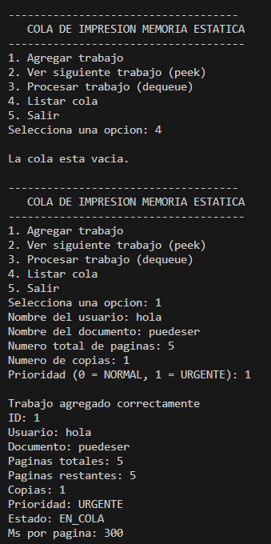

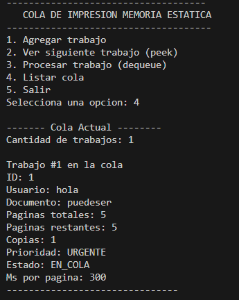

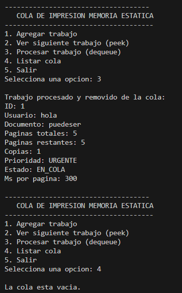

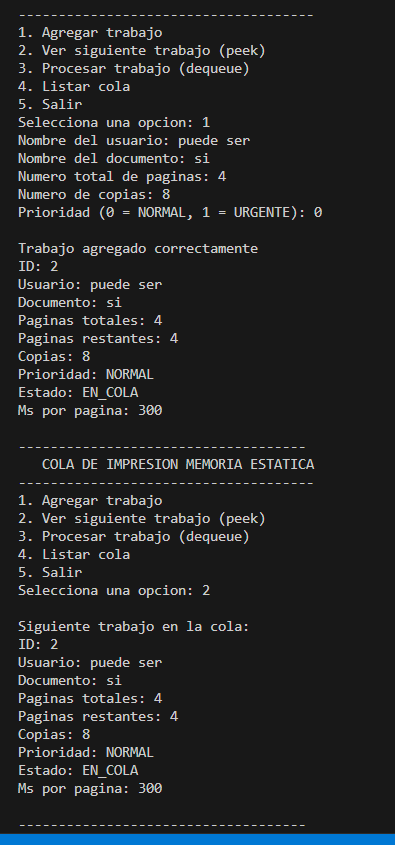

## Ejecucion dinamico

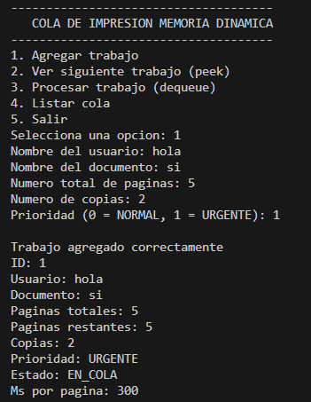

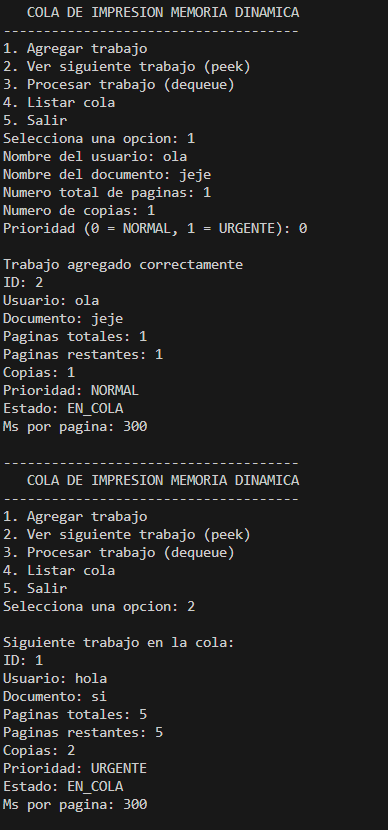

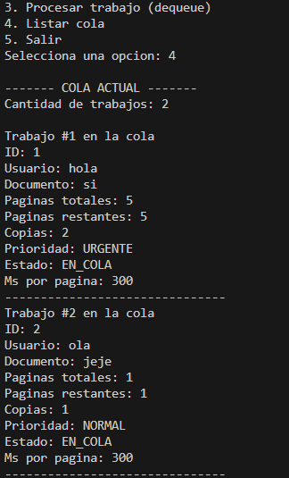

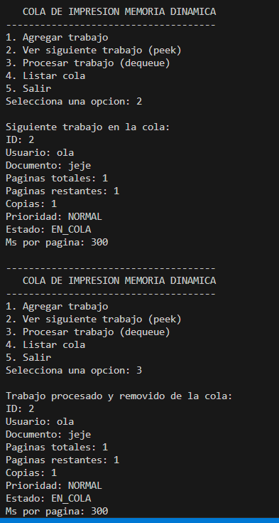

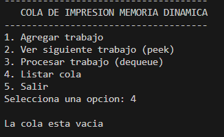

## Ejecucion 3

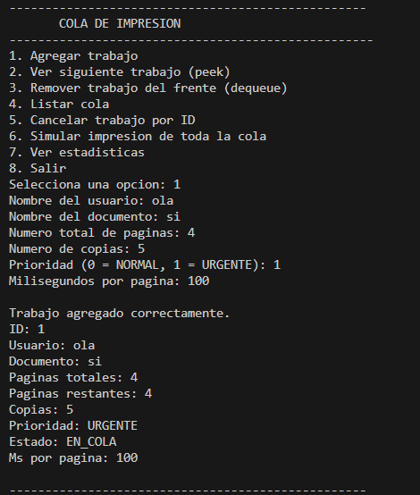

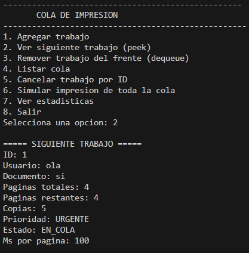

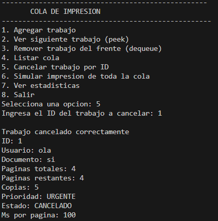

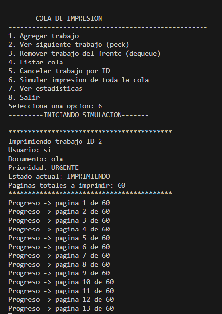

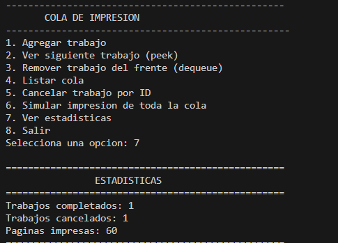

## Preguntas

1. ¿Dónde guardaste el contador de id y por qué? 

El contador de `id` lo guardé en la función principal `main`, en la variable `siguiente_id`. Lo hice ahí porque desde el menú principal se van registrando los nuevos trabajos y cada vez que se agrega uno nuevo ese contador aumenta en 1.

De esta forma cada trabajo recibe un identificador único y es más fácil controlarlo después, por ejemplo al momento de cancelarlo por `id`. También me pareció una buena opción porque el `main` es quien controla todo el flujo del programa y desde ahí se administran las operaciones principales de la cola.

2. En tu versión dinámica: ¿qué función es responsable de liberar memoria? ¿cómo lo verificas?

La función principal encargada de liberar toda la memoria al final del programa es `qd_destroy`. Esta función recorre toda la lista enlazada nodo por nodo y libera cada uno usando `free`.

Además, durante la ejecución normal también se libera memoria en `qd_dequeue`, porque cuando se remueve el trabajo del frente de la cola, el nodo correspondiente se elimina y su memoria también se libera con `free`.

Lo verifiqué revisando que:
- cada nodo creado con `malloc` en `qd_enqueue` tenga su liberación correspondiente
- `qd_dequeue` use `free` al sacar un elemento
- `qd_destroy` recorra toda la cola y libere los nodos restantes antes de salir

Con eso se evita que queden nodos reservados en memoria al terminar el programa

3. ¿Qué invariantes mantiene tu cola? (por ejemplo: rangos y significado de front/rear/size)

En mi versión dinámica la cola mantiene varias invariantes importantes:

- `head` siempre apunta al primer nodo de la cola
- `tail` siempre apunta al último nodo de la cola
- si la cola está vacía, entonces `head == NULL` y `tail == NULL`
- si la cola tiene al menos un elemento, entonces `head != NULL`
- el campo `size` representa la cantidad real de nodos almacenados en la cola
- después de un `enqueue`, el nuevo trabajo queda al final, excepto si es urgente, en cuyo caso se inserta al frente por la mejora de prioridad
- después de un `dequeue`, el frente avanza al siguiente nodo
- si al eliminar un nodo la cola queda vacía, entonces `tail` también se vuelve `NULL`

Estas condiciones ayudan a que la estructura de la cola se mantenga consistente durante toda la ejecución del programa

4. ¿Por qué peek no debe modificar la cola?

La función `peek` no debe modificar la cola porque su propósito es solamente consultar cuál es el siguiente trabajo que se va a atender. Si `peek` cambiara la cola, entonces dejaría de ser una operación de consulta y se comportaría como un `dequeue`.

La ventaja de `peek` es que permite ver el trabajo que está al frente sin eliminarlo, lo cual es útil para revisar el siguiente elemento pendiente sin alterar el orden de la cola ni perder información.

5. Si el programa falla al agregar trabajos, ¿cómo distingues entre “cola llena” y “entrada in-
válida”?

En la versión estática, la situación de “cola llena” se distingue revisando si la cantidad de elementos llegó al límite máximo definido por `MAX_JOBS`. En ese caso el problema no es la entrada del usuario, sino que la estructura ya no tiene espacio para guardar más trabajos.

En cambio, una “entrada inválida” ocurre cuando el usuario introduce datos incorrectos, por ejemplo un número negativo en páginas o copias, o un valor fuera de lo esperado en la prioridad. En ese caso el problema no está en la cola, sino en los datos capturados.

En la versión dinámica ya no existe el problema de “cola llena” como en la estática, porque la memoria se reserva con `malloc` conforme se necesitan nuevos nodos. Ahí el fallo al agregar un trabajo se puede deber a dos cosas:

- que la entrada capturada sea incorrecta
- que `malloc` falle y no pueda reservar memoria

Por eso en la versión dinámica se valida por separado la lectura de datos y también se revisa si `malloc` regresa `NULL`.

## Snippets

### Alcance y duración de variables

En el siguiente fragmento se observa una variable local utilizada dentro de la función principal. La variable `siguiente_id` fue usada para llevar el control de los identificadores de cada trabajo de impresión.

```c
int main(void)
{
    QueueDynamic_t cola;
    Estadisticas_t stats;
    PrintJob_t job;
    PrintJob_t cancelado;
    int opcion;
    int siguiente_id;
    int id_cancelar;

    qd_init(&cola);

    stats.trabajos_completados = 0;
    stats.trabajos_cancelados = 0;
    stats.paginas_impresas = 0;

    siguiente_id = 1;
```

### Reserva de memoria
```c
int qd_enqueue(QueueDynamic_t *q, PrintJob_t job)
{
    Node_t *new_node;

    new_node = (Node_t *)malloc(sizeof(Node_t));
    if (new_node == NULL)
    {
        return 0;
    }
```

Este fragmento demuestra dónde se reserva memoria en el heap para crear un nuevo nodo de la lista enlazada.

### Liberación de memoria
```c
int qd_dequeue(QueueDynamic_t *q, PrintJob_t *out)
{
    Node_t *temp;

    if (q->head == NULL)
    {
        return 0;
    }

    temp = q->head;
    *out = temp->job;

    q->head = temp->next;

    if (q->head == NULL)
    {
        q->tail = NULL;
    }

    free(temp);
    q->size--;

    return 1;
}
```

En este caso la memoria se libera con free(temp) cuando un nodo sale del frente de la cola. Además, al final del programa también se libera toda la memoria restante usando la función qd_destroy.
```c
void qd_destroy(QueueDynamic_t *q)
{
    Node_t *current;
    Node_t *temp;

    current = q->head;

    while (current != NULL)
    {
        temp = current;
        current = current->next;
        free(temp);
    }

    q->head = NULL;
    q->tail = NULL;
    q->size = 0;
}
```
Con esto se evita que queden nodos sin liberar al finalizar el programa.

# Conclusión

En esta práctica pude entender mejor cómo funciona una cola y por qué es útil para resolver un problema real como el manejo de trabajos de impresión. Primero trabajé con una versión estática usando arreglos, lo cual me ayudó a comprender la lógica básica de una estructura FIFO y cómo se agregan, consultan y eliminan elementos en orden.

Después, al migrar la implementación a memoria dinámica, entendí mejor cómo se usan las listas enlazadas y por qué son más flexibles que un arreglo fijo. También aprendí la importancia de reservar memoria con `malloc` y liberarla correctamente con `free`, ya que si no se hace se pueden producir fugas de memoria.

En la última parte, la simulación permitió que el programa se pareciera más a un caso real, porque ya no solo almacenaba trabajos, sino que también mostraba el proceso de impresión página por página. Además, las mejoras implementadas como prioridad, cancelación y estadísticas hicieron que el sistema fuera más completo y funcional.

Esta práctica me ayudó a reforzar temas importantes del lenguaje C como structs, enums, punteros, memoria dinámica, funciones y validación lógica del flujo del programa. También me permitió comparar de forma más clara las ventajas y desventajas entre una cola estática y una dinámica.

## Referencias

G2d, P. [@programaciong2d]. (s/f). Areas de memoria en C, Estatica, Stack y Heap [[Object Object]]. Youtube. Recuperado el 14 de marzo de 2026, de https://www.youtube.com/watch?v=FBEh5XV9QQc

Programación en C con Memoria Dinámica. (s/f). Google.com. Recuperado el 14 de marzo de 2026, de https://sites.google.com/site/programacioniiuno/temario/unidad-1---manejo-de-memoria-dinmica/programacin-en-c-con-memoria-dinmica

(S/f). Sciencedirect.com. Recuperado el 14 de marzo de 2026, de https://www.sciencedirect.com/topics/computer-science/static-memory

