+++
date = '2026-02-13T18:16:44-08:00'
draft = false
title = 'Practica2: El paradigma orientada a objetos'
+++

# Introducción

En esta práctica se desarrolló un simulador de estacionamiento utilizando Python y aplicando los conceptos básicos de la Programación Orientada a Objetos. La idea principal fue crear un sistema capaz de registrar la entrada y salida de vehículos, asignarles un lugar disponible y llevar un control de la ocupación del estacionamiento.

Durante esta primera sesión el enfoque fue construir el modelo del sistema y hacerlo funcionar en consola, sin usar todavía interfaz gráfica o web. También se buscó que el código reflejara correctamente conceptos como encapsulación, composición y abstracción, los cuales son fundamentales en POO.

# Modelo del dominio

Para representar el sistema se definieron varias clases que simulan los elementos reales de un estacionamiento:

* Vehicle: representa un vehículo, guardando sus placas y su tipo, por ejemplo carro o motocicleta
* ParkingSpot: representa un lugar del estacionamiento, indicando si está libre u ocupado y qué tipo de vehículo acepta
* Ticket: representa el registro de entrada de un vehículo, incluyendo el lugar asignado y su estado
* RatePolicy: define la forma en que se calcula el costo del estacionamiento
* ParkingLot: es la clase principal que administra todo el sistema, como los lugares, los tickets activos y las operaciones de entrada y salida

Estas clases trabajan juntas para simular el comportamiento de un estacionamiento real, donde un vehículo entra, se le asigna un lugar, permanece cierto tiempo y luego sale pagando una cantidad dependiendo del tiempo.

# Evidencia de conceptos de POO

Durante el desarrollo del sistema se aplicaron varios conceptos importantes de la Programación Orientada a Objetos:

### 1. Encapsulación

Se utilizaron atributos privados dentro de las clases, por ejemplo en Vehicle o ParkingSpot, evitando que se modifiquen directamente desde fuera. En su lugar, se usan métodos para acceder a la información, lo que ayuda a mantener el control del estado del sistema.

### 2. Composición

La clase ParkingLot contiene y administra una colección de objetos ParkingSpot y también los Ticket activos. Esto significa que el sistema está formado por varios objetos que trabajan juntos.

### 3. Abstracción

Se implementó la clase RatePolicy, que define cómo se calcula el costo del estacionamiento. Esto permite separar la lógica de cobro del resto del sistema, haciendo el diseño más limpio y fácil de modificar en el futuro.

### 4. Modelo del dominio

El sistema representa correctamente entidades del mundo real como vehículos, lugares y tickets, lo cual facilita entender el funcionamiento del programa.

# Pruebas manuales

Se realizaron pruebas para verificar el correcto funcionamiento del sistema:

### Prueba 1: Registro de entrada

Se ingresaron las placas y el tipo de vehículo, y el sistema asignó automáticamente un lugar disponible y generó un ticket.

### Prueba 2: Consulta de ocupación

Después de registrar vehículos, se consultó el estado del estacionamiento, mostrando la cantidad de lugares libres y ocupados.

### Prueba 3: Registro de salida

Se ingresó el ID del ticket y el número de horas, el sistema calculó el costo, liberó el lugar y eliminó el ticket activo.

Estas pruebas demuestran que el sistema cumple con las operaciones básicas solicitadas.

# Conceptos de Programación Orientada a Objetos (POO)

## Clase

Una clase es como un “molde” o plantilla que define cómo será un objeto. Dentro de una clase se especifican sus atributos (datos) y métodos (funciones).

Por ejemplo, en el proyecto se tiene la clase Vehicle, que define que todo vehículo debe tener placas y un tipo:

``` python
class Vehicle:
    def __init__(self, plate, vehicle_type):
        self.__plate = plate
        self.__type = vehicle_type
```

Aquí la clase define qué características tendrá cualquier vehículo que se cree.

## Objeto

Un objeto es una instancia de una clase, es decir, algo real creado a partir de ese molde.

Por ejemplo:
```python
v1 = Vehicle("ABC-123", "Car")
```

Ese v1 es un objeto, ya tiene valores reales (placas y tipo) y representa un vehículo específico dentro del sistema.

## Encapsulamiento

El encapsulamiento consiste en proteger los datos internos de una clase para que no se modifiquen directamente desde fuera, usando atributos privados y métodos de acceso.

En el proyecto se usa así:

```python
self.__plate = plate
```
El doble guion bajo (__) hace que el atributo sea privado. Para acceder se usa un método:
```python
def get_plate(self):
    return self.__plate
```

Esto ayuda a evitar errores y mantener el control del sistema.

## Abstracción

La abstracción consiste en ocultar los detalles internos y mostrar solo lo necesario. Es decir, simplificar cómo interactuamos con el sistema.

Un ejemplo es RatePolicy, que define cómo calcular el costo sin importar cómo se implemente:

```python
class RatePolicy:
    def calculate(self, hours, vehicle):
        pass
```

El sistema solo sabe que existe un método calculate, pero no necesita saber cómo funciona internamente.

## Herencia

La herencia permite crear nuevas clases basadas en una clase existente, reutilizando su código.

Por ejemplo, en este sistema se podrían tener:

```python
class Car(Vehicle):
    pass

class Motorcycle(Vehicle):
    pass
```
Aquí Car y Motorcycle heredan de Vehicle, por lo que ya tienen placas y tipo sin tener que volver a escribirlo.

## Polimorfismo

El polimorfismo permite que diferentes objetos respondan de manera distinta a un mismo método.

En el proyecto esto se puede ver con el cálculo del costo:

```python
class SimpleRatePolicy(RatePolicy):
    def calculate(self, hours, vehicle):
        if vehicle.get_type() == "Car":
            return hours * 20
        elif vehicle.get_type() == "Motorcycle":
            return hours * 10
```
El mismo método calculate se usa para todos los vehículos, pero el resultado cambia dependiendo del tipo.

También se podría tener otra política diferente sin cambiar el resto del sistema, lo cual demuestra el polimorfismo.

# SESION 1

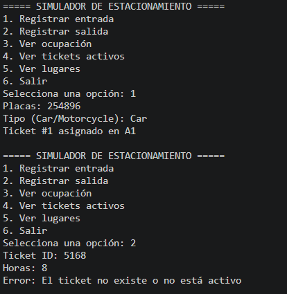

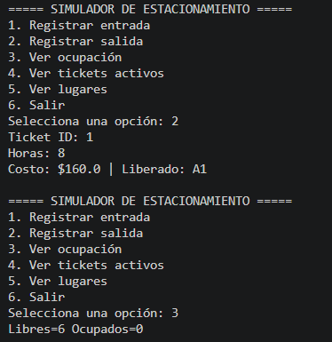

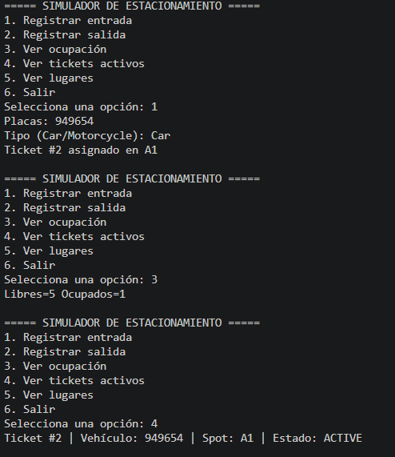

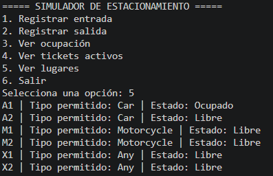

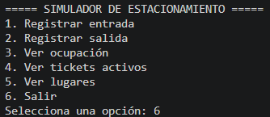

# SESION 2

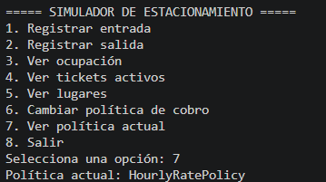

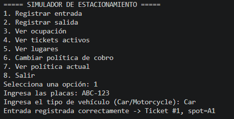

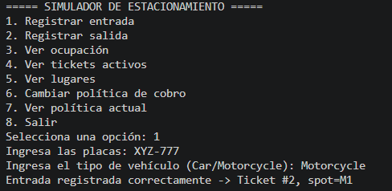

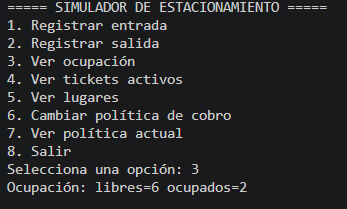

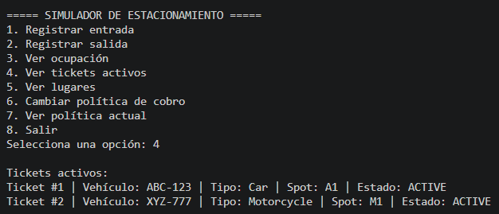

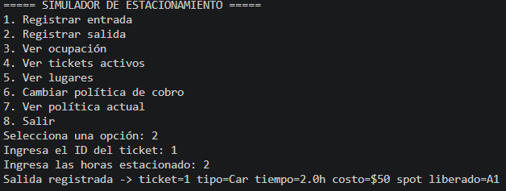

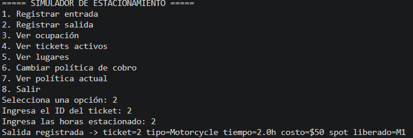

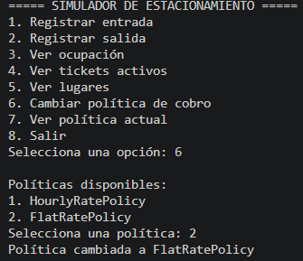

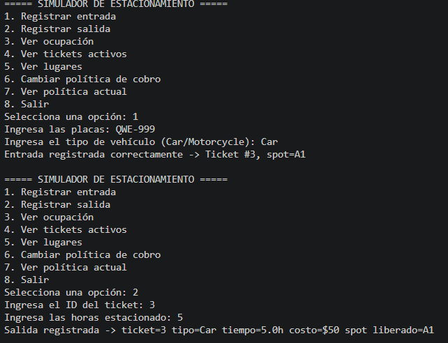

# SESION 3

En esta sesión se desarrolló una interfaz web utilizando Flask para interactuar con el sistema de estacionamiento previamente creado.

Se utilizó una arquitectura tipo MVC donde:

- El modelo corresponde a las clases desarrolladas en sesiones anteriores (Vehicle, ParkingSpot, Ticket, ParkingLot, RatePolicy).
- La vista se implementó mediante plantillas HTML (dashboard, entry y exit).
- El controlador se desarrolló en el archivo app.py, donde se definieron las rutas que conectan la interfaz con la lógica del sistema.

Se implementaron tres pantallas principales:

1. Dashboard: muestra la ocupación del estacionamiento y los tickets activos.
2. Registrar entrada: permite ingresar un vehículo y asignarle un lugar.
3. Registrar salida: permite calcular el costo y liberar el lugar.

El sistema funciona correctamente en un entorno web, permitiendo realizar operaciones de entrada y salida desde el navegador.

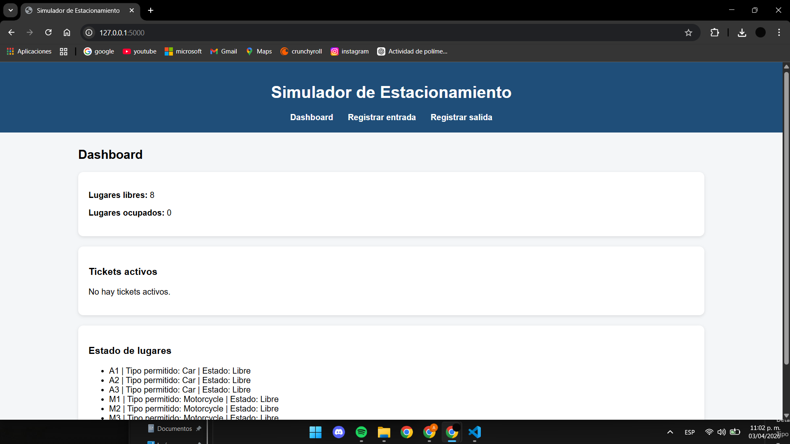

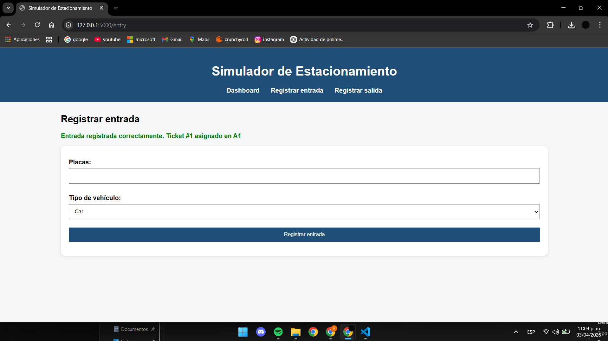

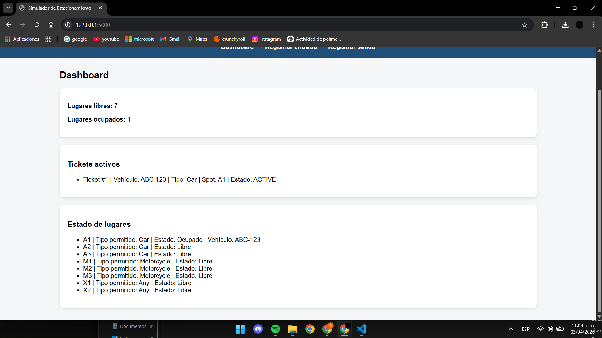

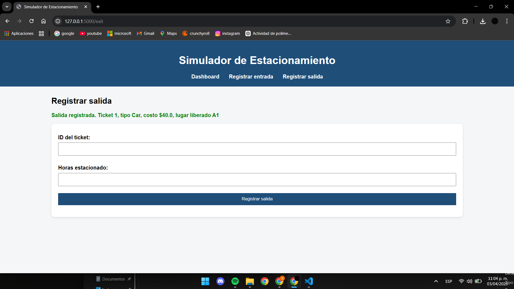

## Conclusion

En esta práctica fui entendiendo poco a poco cómo se puede construir un sistema completo desde cero empezando en consola y terminando en una interfaz web que ya se siente más real, al inicio me costó un poco organizar todo pero conforme fui avanzando entendí mejor cómo funcionan las clases los objetos y cómo se relacionan entre sí, también me quedó más claro el uso de herencia y polimorfismo porque ya no solo era teoría sino algo que sí veía funcionando en el programa, algo importante es que parte del código lo apoyé con inteligencia artificial pero no solo lo copié sino que traté de entender cómo funcionaba cada parte para poder usarlo correctamente y adaptarlo a lo que pedía la práctica, lo que más me llamó la atención fue poder pasar de un programa en consola a uno en Flask ya que ahí se nota más cómo todo el código se conecta con algo visual y usable, además me ayudó a ver cómo separar el modelo la vista y el controlador sin tener que repetir lógica