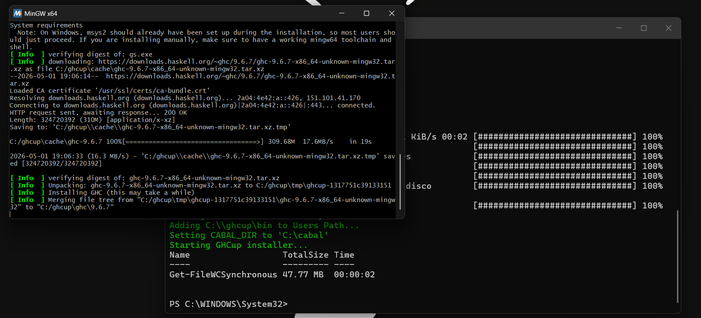
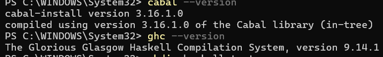
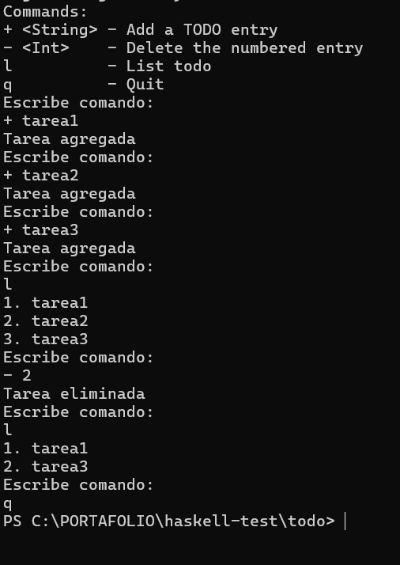
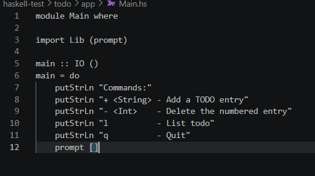
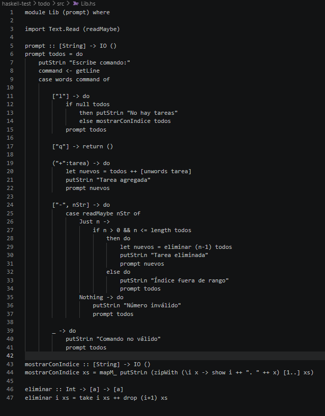
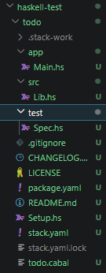

+++
date = '2026-02-13T18:16:48-08:00'
draft = false
title = 'Practica3: El paradigma funcional'
+++

# Reporte – Desarrollo de aplicación en Haskell

## Primera sesión: Instalación del entorno de desarrollo

Para comenzar a trabajar con Haskell, se accedió a la página oficial de descargas:

https://www.haskell.org/downloads/

En esta página se indica que la instalación del entorno se realiza mediante GHCup, una herramienta que permite instalar automáticamente los componentes necesarios.


---

### Proceso de instalación

1. Se ingresó a la página de GHCup  
2. Se copió el comando de instalación  
3. Se ejecutó en PowerShell sin permisos de administrador  
4. Se aceptaron las opciones recomendadas  

Durante este proceso se instalaron los siguientes componentes:

- GHC → compilador de Haskell  
- HLS → servidor del lenguaje  
- Stack → manejador de paquetes  
- Cabal → herramienta de construcción  

---

### Problemas durante la instalación

Durante la instalación se presentaron errores relacionados con rutas del sistema en Windows, lo cual impidió que algunas herramientas se configuraran correctamente.

Para solucionarlo:
- Se cambió el directorio de trabajo a la carpeta del usuario  
- Se ejecutaron comandos manuales con GHCup  
- Se instaló Cabal manualmente  

---

### Verificación

Se comprobó la instalación con:

```bash
ghc --version
```



Confirmando que el compilador se instaló correctamente.

#### Segunda sesión: Introducción a Haskell

Antes de comenzar la práctica, se revisó material introductorio sobre el lenguaje:

https://wiki.haskell.org/Haskell_Tutorial_for_C_Programmers

El objetivo fue comprender el paradigma funcional y la sintaxis básica de Haskell.

## Funcionamiento de la aplicación TODO

La aplicación TODO desarrollada en Haskell es un programa de consola que permite gestionar una lista de tareas mediante comandos ingresados por el usuario.

El programa inicia mostrando un menú de opciones, donde el usuario puede interactuar escribiendo comandos específicos. Internamente, la aplicación utiliza una lista de tipo `String` para almacenar las tareas y una función recursiva que mantiene el programa en ejecución hasta que el usuario decide salir.

### Flujo de ejecución

1. El programa inicia y muestra los comandos disponibles.  
2. Se solicita al usuario que ingrese un comando.  
3. Dependiendo del comando, se ejecuta una acción:
   - Agregar una tarea  
   - Listar tareas  
   - Eliminar una tarea  
   - Salir del programa  
4. La lista de tareas se actualiza dinámicamente en cada interacción.  
5. El programa continúa ejecutándose hasta que se ingresa el comando `q`.

### Archivos en Haskell

Los archivos de código fuente utilizan la extensión:

.hs

###  Proceso de desarrollo
- Se creó el proyecto:
stack new todo
- Se modificaron los archivos principales:
Main.hs → controla la ejecución
Lib.hs → contiene la lógica
- Se compiló y ejecutó:
stack run
Funcionamiento de la aplicación

### Comandos disponibles

- `+ tarea` → Agrega una nueva tarea a la lista  
- `l` → Muestra todas las tareas registradas  
- `- n` → Elimina la tarea en la posición indicada  
- `q` → Finaliza la ejecución del programa  

Las tareas se almacenan en una lista de tipo String.

###Ejemplo de uso
- '+ tarea1'
-  '+tarea2'
- l
- 1.tarea1
- 2.tarea2

- 1
- l
- 1.tarea2
Implementación

### Se utilizaron los siguientes conceptos:

* Listas
* Funciones recursivas
* Entrada de usuario (getLine)
* Validación de datos
* Conclusión

## Satck run para correr el haskell


## Codigo main.hs modificado


## Codigo libs.hs modificado


# Carpeta con datos de haskell



## Conclusión

Haskell utiliza el paradigma funcional, lo cual representa una forma diferente de programar en comparación con lenguajes tradicionales.

A pesar de algunos problemas durante la instalación, se logró configurar el entorno correctamente. La aplicación TODO permitió comprender cómo manejar datos, listas y entrada del usuario en Haskell.