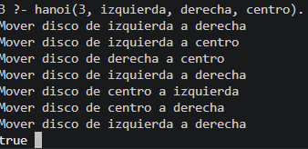
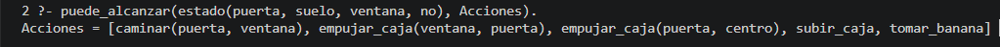

+++
date = '2026-02-13T18:16:51-08:00'
draft = false
title = 'Practica4: El paradigma logico'
+++

# Práctica IV - El paradigma lógico

---

# Introducción

En esta práctica se trabajó con el paradigma lógico utilizando el lenguaje Prolog. El objetivo principal fue comprender cómo funciona la programación lógica mediante el uso de hechos, reglas y consultas. Durante las sesiones se realizaron ejercicios básicos para familiarizarse con la sintaxis del lenguaje y posteriormente se desarrollaron aplicaciones más completas utilizando relaciones familiares, recursividad y problemas clásicos como las Torres de Hanoi y el problema del mono y la banana.

El paradigma lógico se diferencia de otros paradigmas porque se basa en conocimiento y relaciones entre objetos en lugar de instrucciones paso a paso. En Prolog el programador define hechos y reglas, mientras que el motor lógico se encarga de encontrar respuestas a las consultas realizadas.

---

# Primera sesión

## Instalación del entorno de desarrollo

Durante la primera sesión se instaló el entorno de desarrollo de Prolog. Se utilizó GNU Prolog debido a su facilidad de uso y compatibilidad con los ejercicios de la práctica. La instalación consistió en descargar el instalador correspondiente al sistema operativo y seguir el asistente de instalación.

Posteriormente se verificó el correcto funcionamiento del entorno ejecutando comandos básicos desde la consola de Prolog.

## Introducción a Prolog

Se revisaron los conceptos fundamentales del lenguaje, especialmente la estructura de hechos, reglas y consultas.

### Ejemplo de hechos

```prolog
cat(tom).
loves_to_eat(jorge,pasta).
lazy(juan).
```

Los hechos representan información que se considera verdadera dentro de la base de conocimientos.

### Ejemplo de reglas

```prolog
happy(lili) :- dances(lili).
hungry(tom) :- search_for_food(tom).
```

Las reglas permiten definir relaciones condicionales entre elementos.

### Ejemplo de consultas

```prolog
?- cat(tom).
?- happy(lili).
```

Las consultas sirven para preguntar información a la base de conocimientos.

## Bases de conocimiento

También se realizaron ejemplos utilizando bases de conocimiento simples.

### Base de conocimientos #1

```prolog
girl(priya).
girl(natasha).
girl(jasmin).
can_cook(priya).
```

Esta base de conocimientos permite identificar hechos simples, por ejemplo, quiénes son niñas y quién puede cocinar.

### Base de conocimientos #2

```prolog
sing_a_song(ana).
listens_to_music(rodrigo).
listens_to_music(ana) :- sing_a_song(ana).
happy(ana) :- sing_a_song(ana).
happy(rodrigo) :- listens_to_music(rodrigo).
plays_guitar(rodrigo) :- listens_to_music(rodrigo).
```

En esta segunda base se observa cómo una regla puede depender de un hecho. Por ejemplo, si Ana canta una canción, entonces también escucha música y está feliz.

### Base de conocimientos #3

```prolog
can_cook(priya).
can_cook(jasmin).
can_cook(timoteo).

likes(priya,jasmin) :- can_cook(jasmin).
likes(priya,timoteo) :- can_cook(timoteo).
```

Esta base muestra cómo se pueden crear relaciones a partir de otros hechos ya definidos. En este caso, Priya puede tener preferencia por personas que saben cocinar.

## Resultado de la primera sesión

En esta primera parte se comprendió la estructura básica de Prolog. Se aprendió que cada hecho debe terminar con punto, que los nombres normalmente se escriben en minúsculas y que las variables se escriben iniciando con mayúscula. También se observó que Prolog responde consultas de acuerdo con los hechos y reglas que existen dentro de la base de conocimientos.

---

# Segunda sesión

## Continuación de programación con Prolog

En la segunda sesión se continuó trabajando con programación en Prolog, pero ahora utilizando relaciones más elaboradas. El objetivo fue entender cómo Prolog puede representar relaciones entre personas, objetos o conceptos, y cómo a partir de hechos simples se pueden construir reglas más completas.

## Relaciones en Prolog

En Prolog una relación permite conectar objetos entre sí. Por ejemplo, si se dice que una persona es padre de otra, esa relación puede representarse como un hecho.

### Ejemplo de relación de hermanos

```prolog
parent(simon, pedro).
parent(simon, raj).
male(pedro).
male(raj).

brother(X,Y) :- parent(Z,X), parent(Z,Y), male(X), male(Y).
```

En este ejemplo se indica que Simón es padre de Pedro y Raj, y que ambos son hombres. Con la regla `brother(X,Y)` se intenta determinar si dos personas son hermanos.

Sin embargo, este tipo de regla puede generar resultados repetidos o incorrectos, porque también puede considerar que una persona es hermano de sí misma. Por eso se agregó una condición para evitar que `X` y `Y` sean iguales.

```prolog
brother(X,Y) :- parent(Z,X), parent(Z,Y), male(X), male(Y), X \== Y.
```

## Árbol de relaciones familiares

Posteriormente se trabajó con una base de conocimientos familiar, donde se definieron personas, género y relaciones de parentesco.

```prolog
female(pam).
female(liz).
female(pat).
female(ann).

male(jim).
male(bob).
male(tom).
male(pete).

parent(pam,bob).
parent(tom,bob).
parent(tom,liz).
parent(bob,ann).
parent(bob,pat).
parent(pat,jim).
parent(pete,jim).
```

Esta base permite representar un árbol familiar en el que se pueden consultar padres, madres, hijos, hermanos y otros parentescos.

## Relación madre y padre

Con los hechos anteriores se crearon reglas para identificar madres y padres.

```prolog
mother(X,Y) :- parent(X,Y), female(X).
father(X,Y) :- parent(X,Y), male(X).
```

La regla `mother(X,Y)` indica que `X` es madre de `Y` si `X` es padre o madre de `Y` dentro de la relación `parent`, y además `X` es mujer. La regla `father(X,Y)` funciona de forma similar, pero verificando que `X` sea hombre.

## Relación hermana y hermano

También se crearon reglas para identificar hermanos y hermanas.

```prolog
sister(X,Y) :- parent(Z,X), parent(Z,Y), female(X), X \== Y.
brother(X,Y) :- parent(Z,X), parent(Z,Y), male(X), X \== Y.
```

Estas reglas indican que dos personas son hermanas o hermanos si comparten un mismo padre o madre, si cumplen con el género correspondiente y si no son la misma persona.

## Relación de tener hijos

```prolog
haschild(X) :- parent(X,_).
```

Esta regla permite saber si una persona tiene hijos. El guion bajo `_` se utiliza cuando no importa conocer el valor exacto de esa variable.

## Base de conocimientos completa

```prolog
female(pam).
female(liz).
female(pat).
female(ann).

male(jim).
male(bob).
male(tom).
male(pete).

parent(pam,bob).
parent(tom,bob).
parent(tom,liz).
parent(bob,ann).
parent(bob,pat).
parent(pat,jim).
parent(pete,jim).

mother(X,Y) :- parent(X,Y), female(X).
father(X,Y) :- parent(X,Y), male(X).
haschild(X) :- parent(X,_).
sister(X,Y) :- parent(Z,X), parent(Z,Y), female(X), X \== Y.
brother(X,Y) :- parent(Z,X), parent(Z,Y), male(X), X \== Y.
```

## Nuevas relaciones familiares

Después se agregaron relaciones más complejas como abuelos, abuelas, esposas y tíos.

```prolog
grandparent(X,Z) :- parent(X,Y), parent(Y,Z).
grandmother(X,Z) :- mother(X,Y), parent(Y,Z).
grandfather(X,Z) :- father(X,Y), parent(Y,Z).
wife(X,Y) :- parent(X,Z), parent(Y,Z), female(X), male(Y).
uncle(X,Z) :- brother(X,Y), parent(Y,Z).
```

Estas reglas muestran cómo Prolog puede construir relaciones nuevas usando otras relaciones ya existentes.

## Base extendida de relaciones familiares

```prolog
female(pam).
female(liz).
female(pat).
female(ann).

male(jim).
male(bob).
male(tom).
male(pete).

parent(pam,bob).
parent(tom,bob).
parent(tom,liz).
parent(bob,ann).
parent(bob,pat).
parent(pat,jim).
parent(pete,jim).

mother(X,Y) :- parent(X,Y), female(X).
father(X,Y) :- parent(X,Y), male(X).
haschild(X) :- parent(X,_).
sister(X,Y) :- parent(Z,X), parent(Z,Y), female(X), X \== Y.
brother(X,Y) :- parent(Z,X), parent(Z,Y), male(X), X \== Y.

grandparent(X,Z) :- parent(X,Y), parent(Y,Z).
grandmother(X,Z) :- mother(X,Y), parent(Y,Z).
grandfather(X,Z) :- father(X,Y), parent(Y,Z).
wife(X,Y) :- parent(X,Z), parent(Y,Z), female(X), male(Y).
uncle(X,Z) :- brother(X,Y), parent(Y,Z).
```

## Recursividad en Prolog

También se trabajó el tema de recursividad mediante relaciones familiares. La recursividad permite que una regla se llame a sí misma para encontrar soluciones más amplias.

```prolog
predecessor(X,Z) :- parent(X,Z).
predecessor(X,Z) :- parent(X,Y), predecessor(Y,Z).
```

La primera regla indica que `X` es predecesor de `Z` si `X` es padre o madre de `Z`. La segunda regla permite buscar generaciones anteriores, por ejemplo, abuelos o bisabuelos.

## Resultado de la segunda sesión

En esta sesión se comprendió mejor cómo Prolog utiliza relaciones para construir conocimiento. También se observó que las reglas pueden combinar varios hechos y que es importante agregar condiciones para evitar respuestas repetidas o incorrectas. Además, la recursividad permitió representar relaciones familiares de varias generaciones.

---

# Tercera sesión

## Aplicaciones con Prolog

En la tercera sesión se trabajaron aplicaciones más completas utilizando Prolog. Se resolvieron dos problemas clásicos: las Torres de Hanoi y el problema del mono y la banana.

Estos ejercicios permitieron aplicar lo aprendido sobre hechos, reglas, consultas y recursividad en problemas que requieren razonamiento lógico.

---

# Problema de las Torres de Hanoi

## Descripción del problema

El problema de las Torres de Hanoi consiste en mover una cantidad de discos desde una torre de origen hacia una torre de destino, utilizando una torre auxiliar. Para resolverlo se deben respetar las siguientes reglas:

- Solo se puede mover un disco a la vez.
- No se puede colocar un disco grande encima de uno más pequeño.
- Todos los discos deben terminar en la torre destino.
- Se puede utilizar una torre auxiliar para realizar los movimientos necesarios.

Este problema es importante porque permite observar el uso de recursividad en Prolog.

## Código en Prolog

```prolog
hanoi(1, Origen, Destino, _) :-
    write('Mover disco de '),
    write(Origen),
    write(' a '),
    write(Destino),
    nl.

hanoi(N, Origen, Destino, Auxiliar) :-
    N > 1,
    M is N - 1,
    hanoi(M, Origen, Auxiliar, Destino),
    hanoi(1, Origen, Destino, Auxiliar),
    hanoi(M, Auxiliar, Destino, Origen).
```

## Explicación del código

El primer caso indica que si solo hay un disco, este se mueve directamente de la torre de origen a la torre destino.

El segundo caso se utiliza cuando hay más de un disco. Primero se mueven `N-1` discos a la torre auxiliar, después se mueve el disco más grande a la torre destino y finalmente se mueven los discos restantes desde la torre auxiliar hacia la torre destino.

## Ejemplo de consulta

```prolog
?- hanoi(3, izquierda, derecha, centro).
```

## salida



## Resultado del problema

Con este ejercicio se observó cómo Prolog puede resolver un problema recursivo dividiéndolo en casos más pequeños. La solución no se basa en escribir todos los movimientos manualmente, sino en definir una regla general que Prolog puede aplicar dependiendo del número de discos.

---

# Problema del mono y la banana

## Descripción del problema

El problema del mono y la banana consiste en representar una situación donde un mono quiere alcanzar una banana que está colgada en una posición alta. Para lograrlo, el mono debe moverse, empujar una caja, subirse a ella y finalmente tomar la banana.

Este problema se utiliza para representar acciones y cambios de estado dentro de la programación lógica.

## Representación del estado

Se puede representar el estado del problema con la siguiente estructura:

```prolog
estado(PosicionMono, AlturaMono, PosicionCaja, TieneBanana)
```

Donde:

- `PosicionMono` indica dónde se encuentra el mono.
- `AlturaMono` indica si el mono está en el suelo o arriba de la caja.
- `PosicionCaja` indica dónde se encuentra la caja.
- `TieneBanana` indica si el mono ya tiene la banana o no.

## Código en Prolog

```prolog
lugar(puerta).
lugar(ventana).
lugar(centro).

mover(
    estado(X, suelo, Caja, Tiene),
    caminar(X, Y),
    estado(Y, suelo, Caja, Tiene)
) :-
    lugar(X),
    lugar(Y),
    X \== Y.

mover(
    estado(X, suelo, X, Tiene),
    empujar_caja(X, Y),
    estado(Y, suelo, Y, Tiene)
) :-
    lugar(X),
    lugar(Y),
    X \== Y.

mover(
    estado(X, suelo, X, Tiene),
    subir_caja,
    estado(X, arriba, X, Tiene)
).

mover(
    estado(centro, arriba, centro, no),
    tomar_banana,
    estado(centro, arriba, centro, si)
).

puede_alcanzar(EstadoInicial, Acciones) :-
    buscar(EstadoInicial, [], Acciones).

buscar(
    estado(_, _, _, si),
    _,
    []
).

buscar(
    EstadoActual,
    Visitados,
    [Accion | RestoAcciones]
) :-
    mover(EstadoActual, Accion, EstadoNuevo),
    \+ member(EstadoNuevo, Visitados),
    buscar(EstadoNuevo, [EstadoNuevo | Visitados], RestoAcciones).
```

## Explicación del código

La acción `caminar(X,Y)` representa que el mono puede caminar de una posición a otra mientras está en el suelo.

La acción `empujar_caja(X,Y)` indica que el mono puede mover la caja de una posición a otra, siempre que el mono y la caja estén en el mismo lugar.

La acción `subir_caja` representa que el mono puede subirse a la caja cuando ambos están en la misma posición.

La acción `tomar_banana` indica que el mono puede tomar la banana si se encuentra en el centro, está arriba de la caja y la caja también está en el centro.

La regla `puede_alcanzar` inicia la búsqueda de una solución desde un estado inicial. Para evitar que el programa se quede repitiendo los mismos movimientos, se utiliza una lista de estados visitados. De esta forma, Prolog busca una secuencia de acciones hasta llegar al estado donde el mono ya tiene la banana.

## Consulta utilizada

```prolog
puede_alcanzar(estado(puerta, suelo, ventana, no), Acciones).
```

## Resultado



## Resultado del problema

Este ejercicio permitió comprender cómo Prolog puede representar acciones y cambios de estado. En lugar de trabajar con instrucciones tradicionales, se describen las condiciones necesarias para que una acción pueda realizarse y el estado final que produce.

---

# Resultados obtenidos

Durante la práctica se logró comprender el funcionamiento básico del paradigma lógico y la manera en que Prolog trabaja con hechos, reglas y consultas. También se aprendió a crear bases de conocimiento, definir relaciones entre objetos y utilizar recursividad.

Además, se desarrollaron soluciones para problemas clásicos utilizando razonamiento lógico, lo cual permitió observar el potencial de Prolog para aplicaciones relacionadas con inteligencia artificial, representación de conocimiento y resolución de problemas.

El uso de reglas permitió construir relaciones nuevas a partir de hechos existentes. También se observó que Prolog puede generar respuestas mediante consultas, utilizando la información disponible en la base de conocimientos.

---

# Conclusión

La práctica permitió conocer las bases de la programación lógica utilizando Prolog. A diferencia de otros paradigmas, en este enfoque no se describe paso a paso cómo resolver un problema, sino que se definen hechos y reglas para que el sistema encuentre las respuestas automáticamente.

El desarrollo de ejercicios simples y problemas más complejos ayudó a comprender mejor conceptos como relaciones, consultas, recursividad y cambios de estado. También se observó cómo Prolog puede ser utilizado para resolver problemas de razonamiento y búsqueda de soluciones de forma eficiente.

Finalmente, esta práctica ayudó a reforzar el entendimiento del paradigma lógico y su importancia dentro del área de inteligencia artificial y representación del conocimiento. Prolog resulta útil porque permite expresar problemas de manera lógica, clara y basada en relaciones.

---

# Referencias

- TutorialsPoint. Prolog Tutorial. Recuperado de: [https://www.tutorialspoint.com/prolog/index.htm](https://www.tutorialspoint.com/prolog/index.htm)
- Material de clase: “Práctica IV - El paradigma lógico”.
- GNU Prolog Official Website. Recuperado de: [http://www.gprolog.org/](http://www.gprolog.org/)

---
